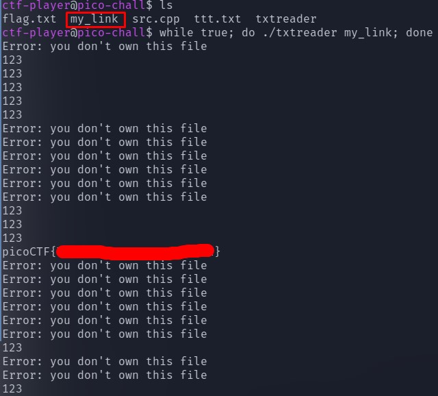

# tic-tac #
 
## Overview ##
 
200 points
 
Category: [Binary Exploitation](../)
 
Tags : `#picoCTF 2023` `Binary Exploitation` `linux` `bash` `toctou`
 
## Description ##

Someone created a program to read text files; we think the program reads files with root privileges but apparently it only accepts to read files that are owned by the user running it.
Additional details will be available after launching your challenge instance.
 
## Solution ##

Самая большая подсказка - тег задачи `toctou`, что является названием вида уязвимостей. `toctou` -> `Time-of-check to time-of-use`

Файлом `flag.txt` владеет root, программой владеет тоже root, но там стоит бит `s` в правах - значит она запустится от рута - мы должны заставить её открыть `flag.txt`, при этом обойдя проверку нашего настоящего uid с uid владельца файла со стороны программы через функцию getuid.

1. Подключаемся по SSH Замечаем, что проверка владения файлом со стороны программы (где getuid == uid_файла) происходит один раз, а дальше идет чтение файла

2. Создаем файл, которым мы владеем - `ttt.txt` - я написал туда `123`

3. Создадим символьную ссылку `my_link` и будем её бесконечно привязывать к `ttt.txt`, затем к `flag.txt` и так по кругу следующим скриптом:

```bash
while true; do ln -sf /home/ctf-player/ttt.txt /home/ctf-player/my_link; ln -sf /home/ctf-player/flag.txt /home/ctf-player/my_link; done &
```

4. Затем запускаем бесконечный цикл, который выполняет программу на `my_link` следующим скриптом:

```bash
while true; do ./txtreader my_link; done
```
5. После этого в определенный момент произойдет следующее: программа проверит uid юзера на совпадение с uid владельца файла, когда `my_link` -> `ttt.txt`. Затем `my_link` переподвяжится на `flag.txt`, а параллельно с этим программа `txtreader` выполнит чтение из `my_link`, тем самым мы получим флаг, т.к. мы обошли проверку uid, а файл `flag.txt` прочитается, т.к. им владеет root, под именем которого программа выполняется


