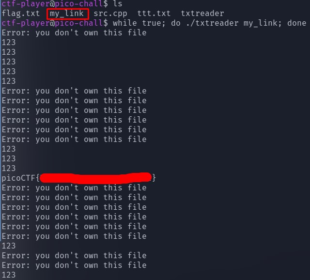

# tic-tac #
 
## Overview ##
 
200 points
 
Category: [Binary Exploitation](../)
 
Tags : `#picoCTF 2023` `Binary Exploitation` `linux` `bash` `toctou`
 
## Description ##

Someone created a program to read text files; we think the program reads files with root privileges but apparently it only accepts to read files that are owned by the user running it.
Additional details will be available after launching your challenge instance.
 
## Solution ##

The most useful hint - tag of the task `toctou`. It is a name of the vulnerability: `toctou` -> `Time-of-check to time-of-use`.

The owner of the `flag.txt` is **root**, also `root` is the owner of the program.

But program have bit `s` in its permissions - it means, that it runs from **root**: we need to trick it to open `flag.txt`, avoiding uid check from the program at the same time.

1. Connect via SSH to the instance. We can see, that there is **one** check for uid.

2. Create a file - I named it `ttt.txt` and wrote `123` inside it.

3. Create a symbol link `my_link`. Let's endlessly make it point to `ttt.txt`, then to `flag.txt` in a loop with following script:

```bash
while true; do ln -sf /home/ctf-player/ttt.txt /home/ctf-player/my_link; ln -sf /home/ctf-player/flag.txt /home/ctf-player/my_link; done &
```

4. Then let's endless loop, that runs `txtreader` over `my_link`:

```bash
while true; do ./txtreader my_link; done
```
5. Then next events will occure: 
    1. Program will check uid, when `my_link` -> `ttt.txt`.
    2. `my_link` will change and point to `flag.txt`.
    3. `txtreader` will read from `my_link` - we have already bypass uid check, so we will get the `flag.txt`.


