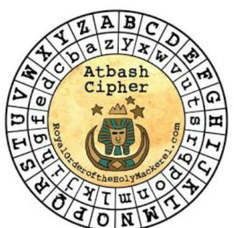
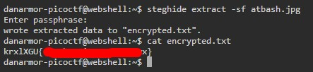
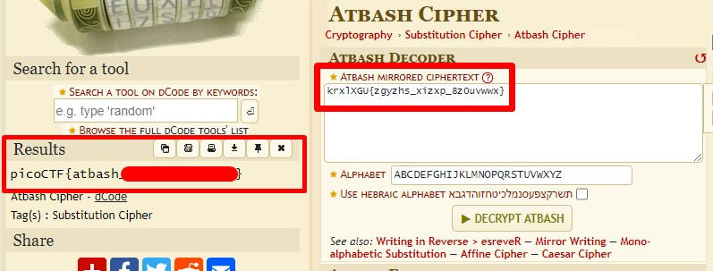

# HideToSee #
 
## Overview ##
 
100 points
 
Category: [Cryptography](../)
 
Tags : `#picoCTF 2023` `Cryptography`
 
## Description ##

How about some hide and seek heh?

Look at this image [here](https://artifacts.picoctf.net/c/238/atbash.jpg). 
 
## Solution ##

Download the image. It looks like this:

Also it has name `atbash.jpg`.

Extract hidden data with `steghide` (no passphrase):

The name of the file `atbash.jpg` - is a hint to encoding algorithm being used for flag.

[Let's decode it](https://www.dcode.fr/atbash-cipher).

