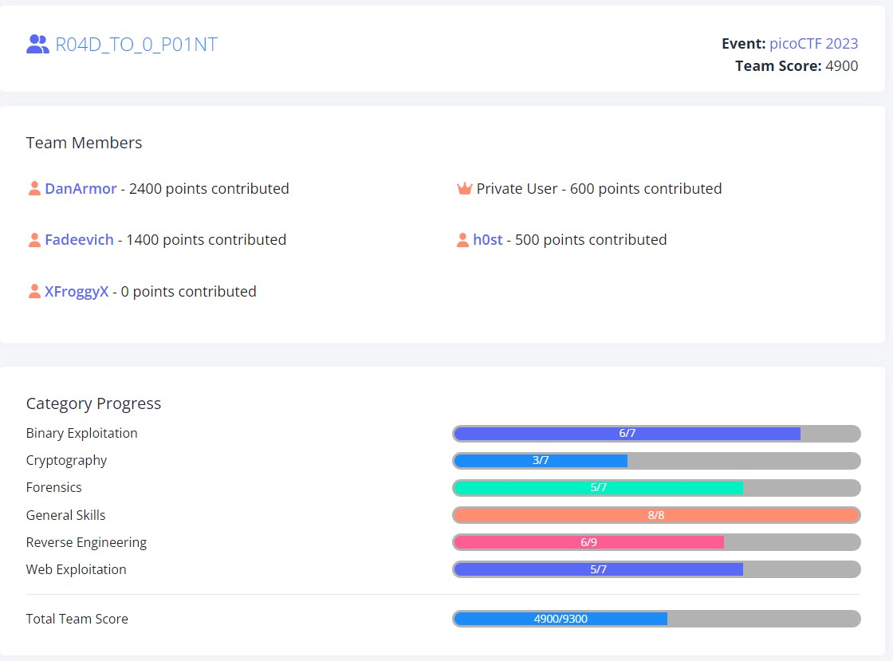

# picoCTF-2023-writeup

## Overview

I participated in the [picoCTF](www.picoctf.org) 2023 competition with a team in the Global category, which ran from *Mar 15 2023* to *Mar 29 2023*

## Progress

## Challenges ##
This event writeup is a work in progress

I will describe, how to solve some challenges, that are not presented in [this repo](https://github.com/snwau/picoCTF-2023-Writeup), that was original inspiration for creating my own writeup repo.

* Cryptography
  * **[HideToSee](Cryptography/HideToSee/HideToSee.md)**
* Web Exploitation
  * **[SOAP](Web%20Exploitation/SOAP/SOAP.md)**
  * **[More SQLi](Web%20Exploitation/More%20SQLi/More-SQLi.md)**
  * **[Java Code Analysis](Web%20Exploitation/Java%20Code%20Analysis/Java-code-analysis.md)**
* Reverse Engineering
  * **[No way out](Reverse%20Engineering/No%20way%20out/No-way-out.md)**
* Binary Exploitation
    * **[babygame02 (EN :gb:)](Binary%20Exploitation/babygame02/babygame02.md)** | **[babygame02 (RU :ru:)](Binary%20Exploitation/babygame02/babygame02-ru.md)**
    * **[tic-tac (EN :gb:)](Binary%20Exploitation/tic-tac/tic-tac.md)** | **[tic-tac (RU :ru:)](Binary%20Exploitation/tic-tac/tic-tac-ru.md)**

Full solutions to the challenges are provided in the write ups, however the actual flag values are withheld.