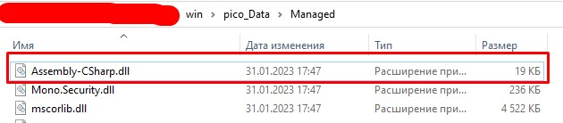
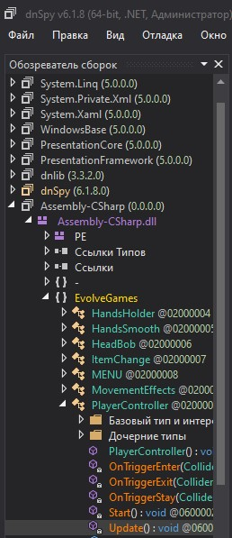
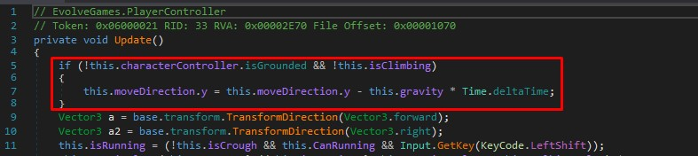
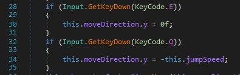
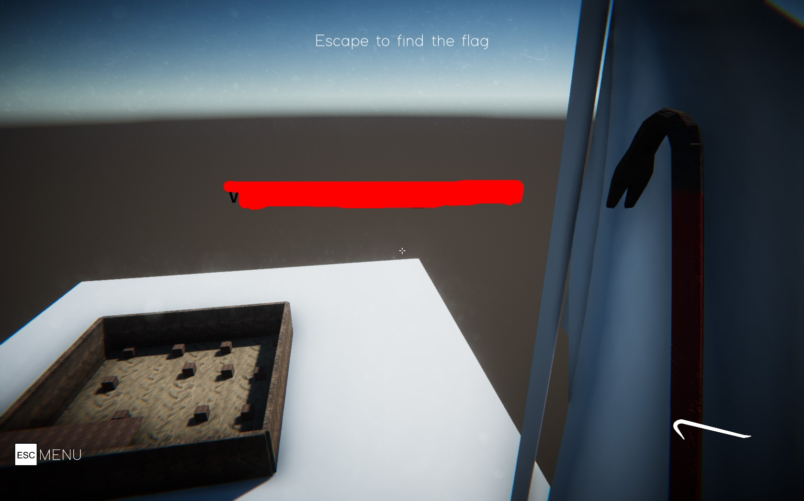

# No way out #
 
## Overview ##
 
200 points
 
Category: [Reverse Engineering](../)
 
Tags : `#picoCTF 2023` `Reverse Engineering`
 
## Description ##
 
Put this flag in standard picoCTF format before submitting. If the flag was `h1_1m_7h3_f14g` submit `picoCTF{h1_1m_7h3_f14g}` to the platform.
[Windows game](https://artifacts.picoctf.net/c/285/win.zip), [Mac game](https://artifacts.picoctf.net/c/285/mac.app.zip)
 
## Solution ##

You need to download [dnSpy](https://github.com/dnSpy/dnSpy) to edit scripts of the game.

Drop this file into dnSpy:

Now go to `Update` method of the `PlayerController` class in the game.

We need to delete this part, so our character will not fall back to the ground, when we jump.

Also we can add something like this to move our character around `y axis`

Then just save changes and jump into the game.

Now we just fly to the flag and the text of the flag will appear in the middle of the screen, when we reach flag prop in game.

Then just submit it in standard form `picoCTF{...}`
