# Java Code Analysis!?! #
 
## Overview ##
 
300 points
 
Category: [Web Exploitation](../)
 
Tags : `#picoCTF 2023` `Web Exploitation`
 
## Description ##
 
BookShelf Pico, my premium online book-reading service.
I believe that my website is super secure. I challenge you to prove me wrong by reading the 'Flag' book!

Additional details will be available after launching your challenge instance.
 
## Solution ##

After start of the instance picoCTF will provide you source code of the site and link to running instance.

Site has login screen:

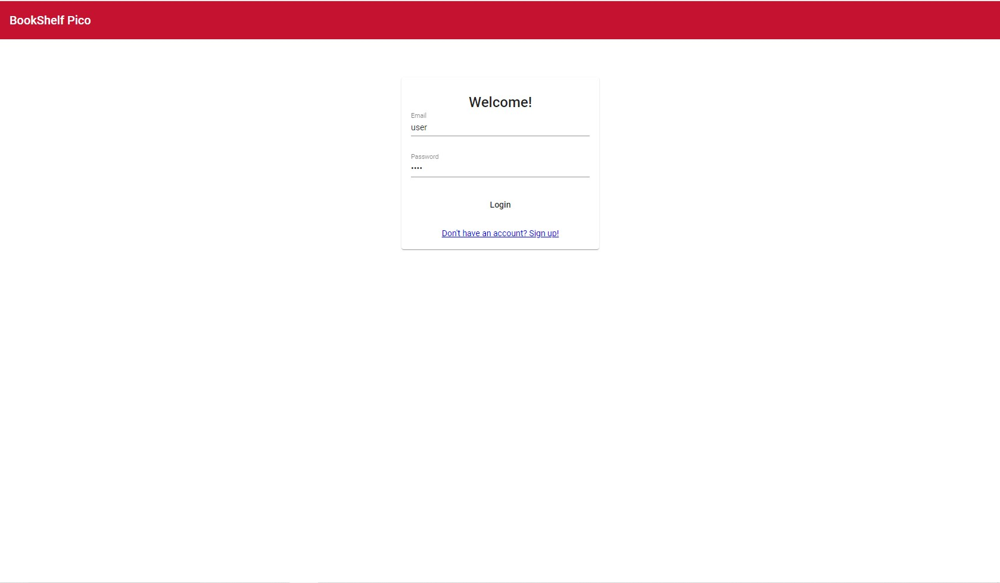

And main screen with books.

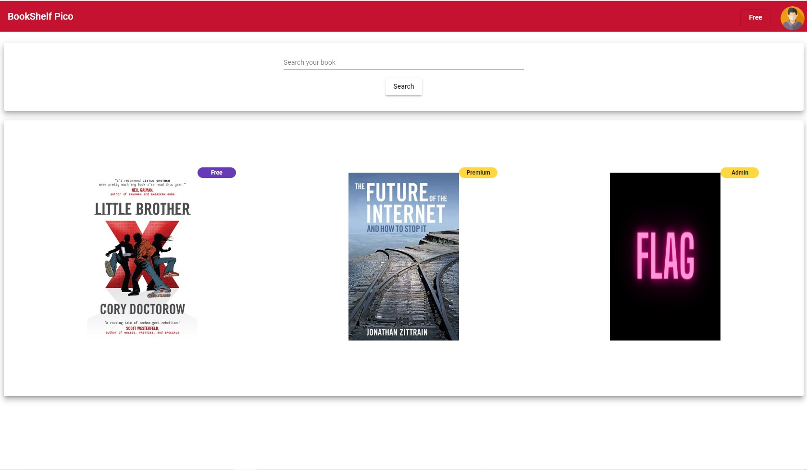

 We can't access any of them except the first one.

Let's dive into code.

There are some files, that are interesting to us.

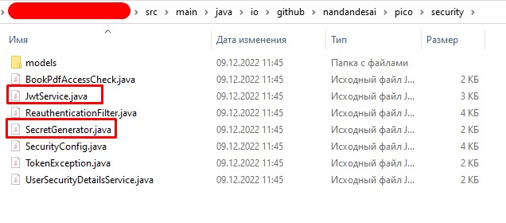

Inside `JwtService.java` we can see all data, that JwtToken contain, the issuer and that `secretGenerator` gives the secret key. 

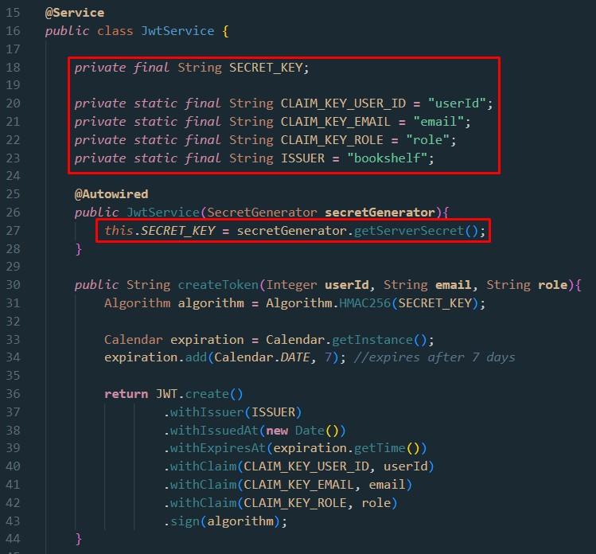

And inside the `SecretGenerator.Java` we see this.

So, now we know, that "secret key" is `1234`. We have all the information to encode and decode JWT tokens.

But we need a userId, so let's get back to the login screen.

Now, I'm using `Google chrome` - press F12, open `Network` tab and login with creds from picoCTF: user:`user`, pass:`user`

And we will get the JWT token for our user in the payload of the response:

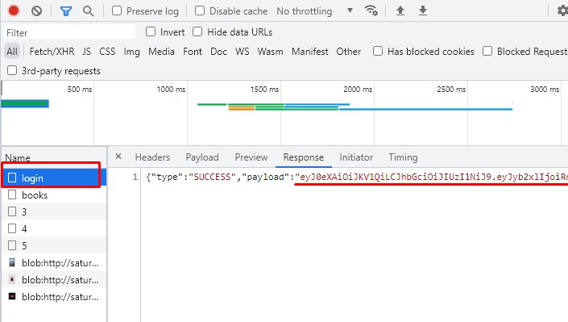

Copy it and go to the [this website](https://jwt.io/). Let's decode it like this:

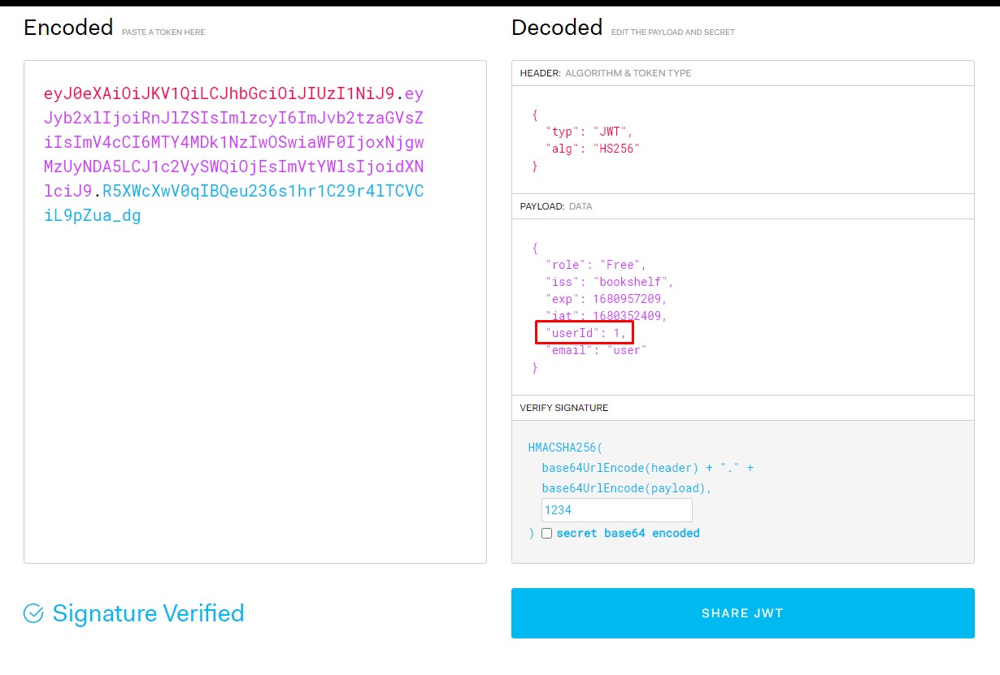

So, `userId` is `1`.

Now let's encode our JWT token with role `Admin`:

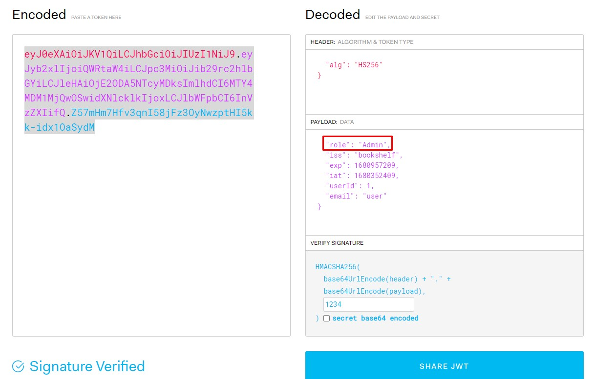

Inside `controllers` directory we can find `UserController.java`, where we can see this endpoint:

Now I will use Postman (because I'm lazy) and send some requests with new JWT to update our role and read the flag.

We need to create new user on the site, because we can't patch default user role.

We need to obtain users list.

First of all - put token into headers. 

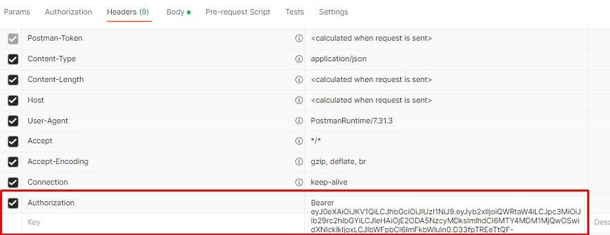

Request:

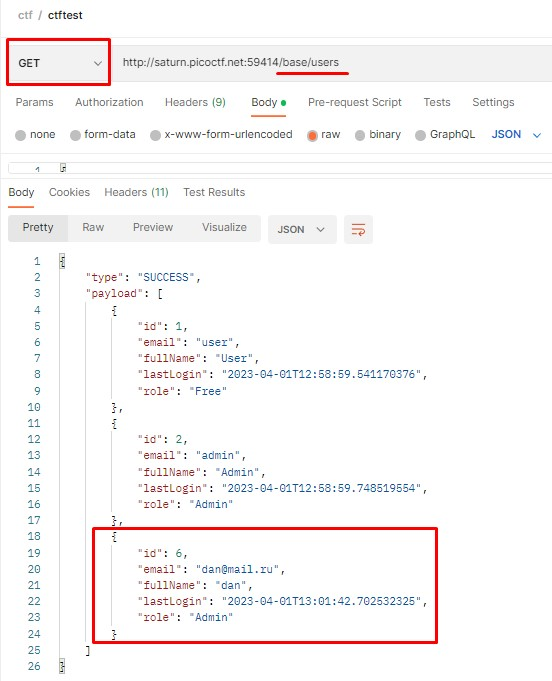

Our id is `6`.

Now let's patch our role:

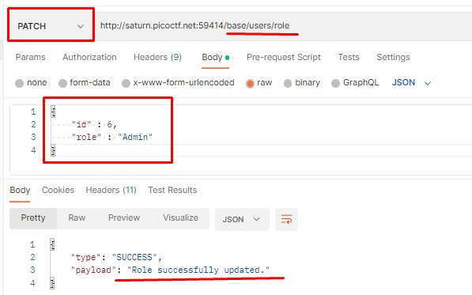

Now we are `Admin` - just login and read the flag:

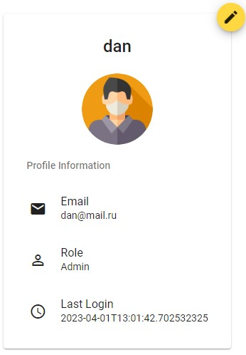

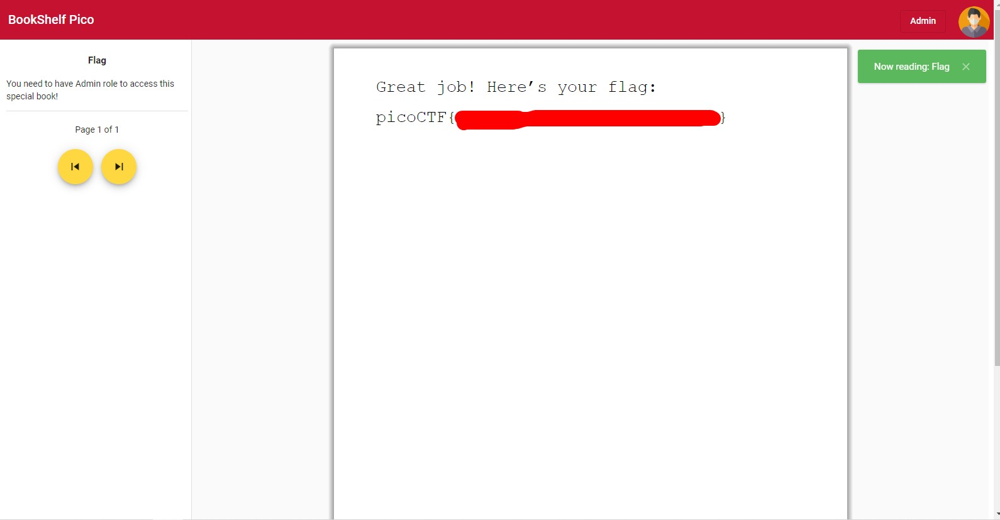
