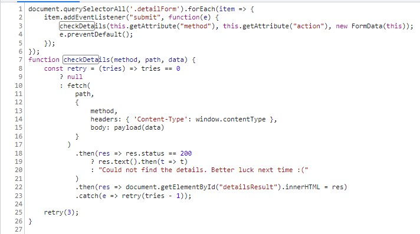
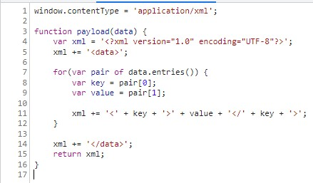
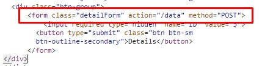
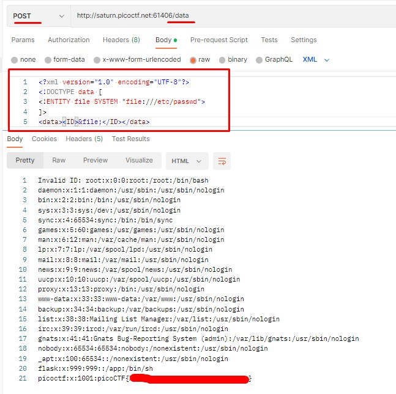

# SOAP #
 
## Overview ##
 
100 points
 
Category: [Web Exploitation](../)
 
Tags : `#picoCTF 2023` `Web Exploitation` `XXE`
 
## Description ##

The web project was rushed and no security assessment was done. Can you read the /etc/passwd file?

Additional details will be available after launching your challenge instance.
 
## Solution ##

After start of the instance picoCTF will provide you a link to running instance.

There is a site.

We saw tag `XXE` -> `XML external entity` and also, when we inspect static resources (F12 -> Sources in Google Chrome) of the site, we saw this two files:

detailsCheck.js

xmlDetailsCheckPayload.js

So, now we know for sure, that it is XXE. 

Also in the index.html we saw the endpoint for the POST request:

We need just to make POST request to the `<url_of_site>/data` with XML payload to get the flag.

Let's check the format for XML request. Just click button on the site and look the request format in `Network` tab:

Now just send `POST` request with our payload and obtain the flag:

